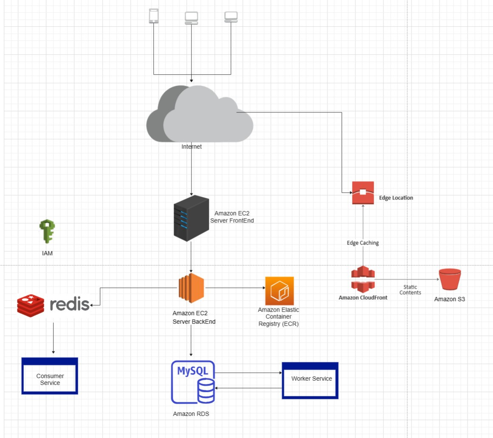

# ParadiseBookingApp
# Backend Application Setup Guide

This guide provides detailed steps to set up and run the Backend application using Docker and Docker Compose. The application consists of three main components: the Backend service, MySQL database, and Redis cache.

## Prerequisites

Before starting, make sure you have installed the following components on your system:
- [Docker](https://docs.docker.com/engine/install/)
- [Docker Compose](https://docs.docker.com/compose/install/)

## Installation Steps

### Step 1: Install Docker

Follow the instructions in the Docker documentation to install Docker for your specific operating system:
- Docker installation guide: [https://docs.docker.com/engine/install/](https://docs.docker.com/engine/install/)

### Step 2: Install Docker Compose

After installing Docker, continue with the Docker Compose installation according to the Docker documentation:
- Docker Compose installation guide: [https://docs.docker.com/compose/install/](https://docs.docker.com/compose/install/)

### Step 3: Run the Application

1. Open the terminal.
2. Navigate to the application directory:
   ```bash
   cd path/to/your/application

### Step 4: Execute the following command to start the application using Docker Compose
   ```bash
    docker compose up -d
   ```
   - The application will run on port 8080 on localhost, and the API export path will be http://localhost:8080/api/v1/

## System Architecture 

